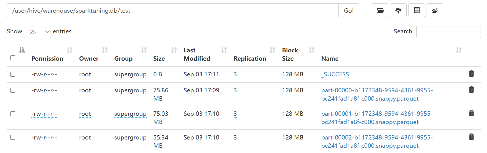
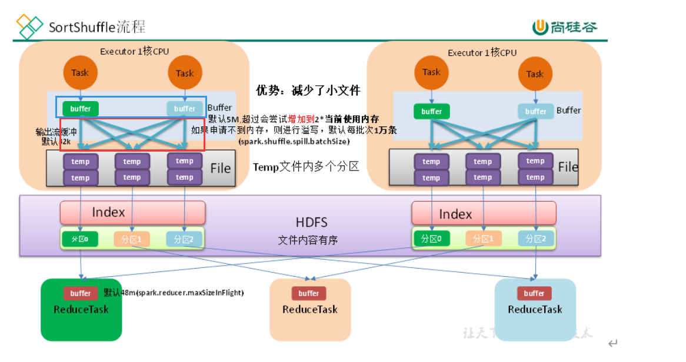
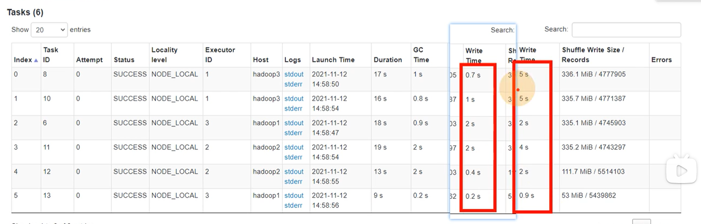

## 1 读取小文件优化

**`N 个小文件总大小 + （N-1）*openCostInBytes <= maxPartitionBytes`**

- maxPartitionBytes = 128mb
- openCostInBytes = 4mb

观察 course_shopping_cart 表的数据文件，共 38 个文件，每个文件基本在 6mb 4mb 左右，这里按 6mb 算

```
n*6+(n-1)*4 = 128
6n + 4n - 4 = 128
10n = 132
n = 13.2
```
大概 13 个文件合并成一个文件

```
38/10 = 3.8
```

大概会合并成 3 个文件，如下图



第一个文件 75mb, 没有达到 128mb, 差的那部分就是打开文件的开销

## 2 增大map溢写时 输出流的buffer

是`输出流的buffer`，不是写入的缓存区的大小

是红框的部分，不是篮框的部分



左边的红框是 设置为64 执行的时间，右边的是 设置为32 执行的时间

