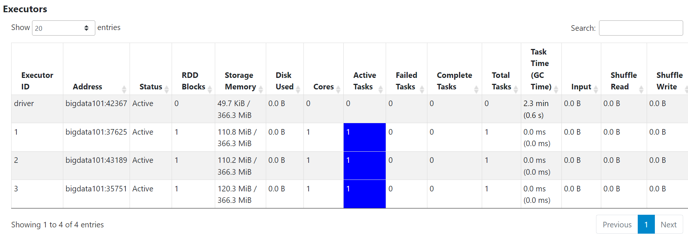
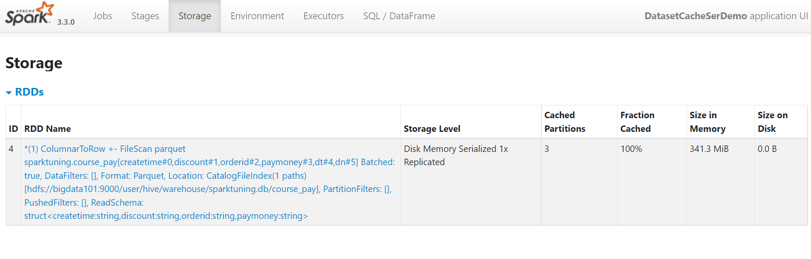

# 内存分配分析

[TOC]

## 1 机器配置

一台虚拟机

- 核心数：4
- 内存：4GB
- 磁盘：30GB

## 2 spark资源配置

- num-executors=3: 一个节点最多3个 executor

- executor-cores=1: 一个 executor 最多使用一个核
 
- executor-memory=1GB: 一个 executor 使用的内存量

堆内存最大值为 1024MB 时，源码里的 systemMemory = 910.5mb  (UnifiedMemoryManager.scala) 

[点这里](https://www.thinbug.com/q/52980629) 查看分析

统一内存 = (910.5mb - 300mb) * 0.6 = 366.3mb

Storage 堆内内存 = 366.3mb * 0.5 = 183.15mb


在执行测试程序前，在 `yarn-site.xml` 文件中添加如下配置:

```xml
	<!--是否启动一个线程检查每个任务正使用的物理内存量，如果任务超出分配值，则直接将其杀掉，默认是 true -->
	<property>
		<name>yarn.nodemanager.pmem-check-enabled</name>
		<value>false</value>
	</property>
	<!--是否启动一个线程检查每个任务正使用的虚拟内存量，如果任务超出分配值，则直接将其杀掉，默认是 true -->
	<property>
		<name>yarn.nodemanager.vmem-check-enabled</name>
		<value>false</value>
	</property>
	<!--节点上YARN可使用的物理内存总量，默认是8192MB -->
	<property>
		<name>yarn-nodemanager.resource.memory-mb</name>
		<value>2048</value>
	</property>
	<!--每个容器允许的最大内存，默认是8192MB -->
	<property>
		<name>yarn.scheduler.maximum-allocation-mb</name>
		<value>2048</value>
	</property>
```

```sh
# 测试程序来自尚硅谷spark调优教程
bin/spark-submit --master yarn --deploy-mode client --driver-memory 1g --num-executors 3 --executor-cores 1 --executor-memory 1g 
--class cache.DatasetCacheSerDemo /root/spark-tuning-1.0-SNAPSHOT-jar-with-dependencies.jar
```

浏览器输出 `bigdata101:8088`, 找到对应的应用程序，点击 `Application Master`，就会调转对应页面

> 图1


> 图2


从第一张图可知， 每个 executor 的 `统一内存量` 是 366.3mb, 
三个 executor 分别写入了 110.8mb、110.2mb、120.3mb 的缓存，
正好等于第二张图的 `Size in Memory` 字段的值 341.3mb.

如果一直刷不出来 Storage 页面，说明任务一直失败，内存是不够的，所以就不使用它了。

这里的 `Storage Memory` 字段是存储内存和执行内存的和，也就是统一内存的大小。
如果在程序中使用了堆外内存，那么这个 `Storage Memory` 字段就包含了堆内和堆外的大小，
也就是 `堆内存储内存 + 堆内执行内存 + 堆外存储内存`

比如 spark.executor.memory=5g, spark.memory.offHeap.size=1g

那么，`Storage Memory` 字段 = (5g-300mb)*0.6 + 1g*0.5 = 3.32g