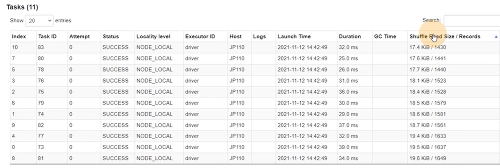
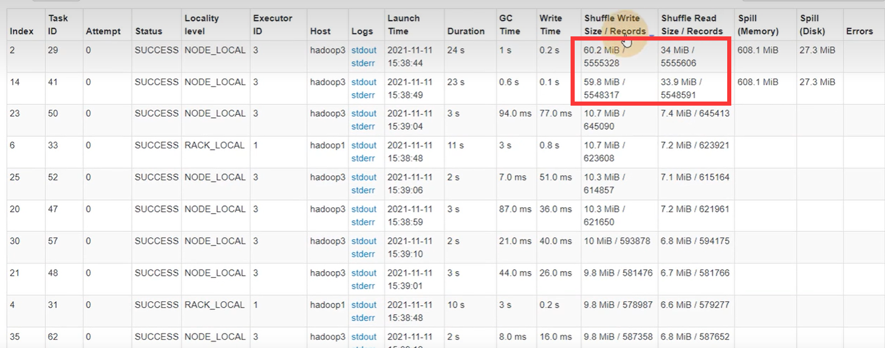
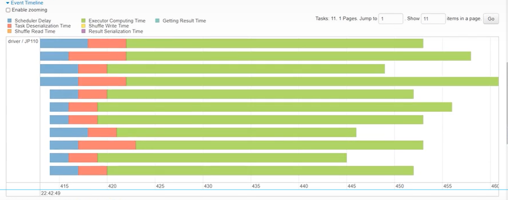
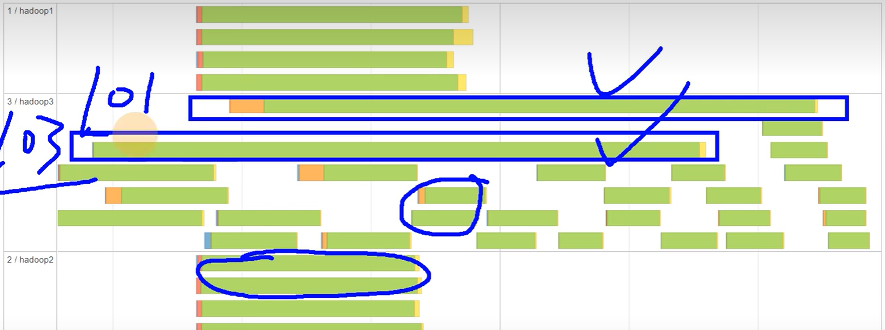
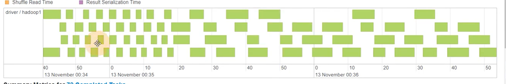

进入 `localhost:4040` 查看

数据是否倾斜可以从下面两处判断

`Shuffle Read Size/Record` `Shuffle Write Size/Record` 字段的数据分布是否均匀，图1就是均匀的

> 图1

> 图2

如果有的任务执行很快（很短的一部分）；有的任务执行很慢（很长的一部分），就是倾斜的。

图3、5就是均匀的，图4就是倾斜的

> 图3

> 图4

> 图5
